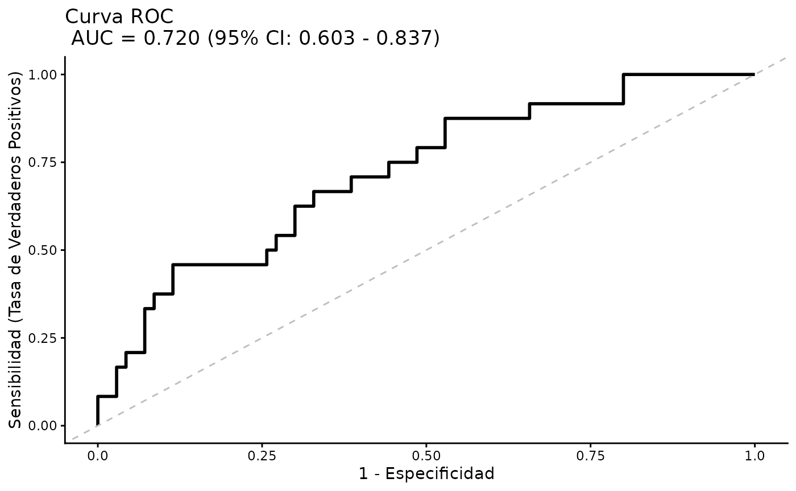

# Introducción a BioEstatR

``` r

library(BioEstatR)
#> --------------------------------------------------------------
#> BioEstatR (ver 1.0.1 - 05/2026)
#>   Biostatistics Routines in R
#>    Pedro Femia*, Miguel Angel Luque Fernandez
#>   Biostatistics Faculty of Medicine - University of Granada
#> 
#>   * Contacto: pfemia@ugr.es, mluquefe@ugr.es
#> --------------------------------------------------------------
data(osteo)
```

## Introducción

Este paquete proporciona una colección de rutinas estadísticas
automatizadas para el análisis descriptivo, y la estadística inferencial
clásica, desarrolladas como soporte para el libro [Matemática
Estadística Médica con
R](https://github.com/migariane/MatematicaEstadisticaMedicinaR).

Todas las funciones han sido actualizadas en la versión 1.0.1 con
referencias científicas a la literatura estadística fundamental para
apoyar su uso y metodología.

## Uso

A continuación se muestran ejemplos básicos de uso de las funciones
principales para la modelización lineal y logística.

### Regresión Lineal Simple

``` r

# Ejemplo de regresión lineal simple
rls(imc ~ peso, data = osteo, grf=F)
#> 
#> Regresión lineal simple 
#> ----------------------------------------------------------------
#> # Información muestral --- 
#> 
#>   variable  n  media     dt   Min    Max  Rango
#> 1      imc 94 23.921  3.748 18.07 37.333 19.264
#> 2     peso 94 63.839 11.804 44.60 99.000 54.400
#> 
#>   Cov(imc,peso) = 35.482
#> 
#> # Correlación de Pearson --- 
#> 
#>       r IC_inf IC_sup gl   texp     sig
#>   0.802  0.716  0.864 92 12.876 < 0.001
#> 
#> # Modelo lineal --- 
#> 
#>   Modelo:  imc ~ peso 
#>   R² =  0.643 
#>   S²residual =  5.068 
#>   :
#> 
#>          Coef estim    se ic_inf ic_sup   texp    sig
#> 1 (Constante) 7.664 1.284  5.115 10.214  5.971 <0.001
#> 2        peso 0.255 0.020  0.215  0.294 12.876 <0.001
#> 
#> # Distribución residual --- 
#>   Error estándar residual: 2.251 
#>        res   zres
#> min -5.763 -2.620
#> Q1  -1.533 -0.685
#> Q2  -0.512 -0.230
#> Q3   1.426  0.649
#> max  8.279  3.757
#> 
#>   Test de normalidad residual (Shapiro-Wilk): 
#>   w =0.96, p= 0.005
```

### Regresión Lineal Múltiple

``` r

# Ejemplo de regresión lineal múltiple
new_data <- data.frame(peso = c(70, 80), talla = c(170, 180))
rlm(imc ~ peso + talla, data = osteo, pred = new_data, grf=F)
#> 
#> Regresión lineal múltiple 
#> ----------------------------------------------------------------
#> # Información muestral --- 
#> 
#>       Variable  n   Media     DT    Min     Max
#> imc        imc 94  23.921  3.748  18.07  37.333
#> peso      peso 94  63.839 11.804  44.60  99.000
#> talla    talla 94 163.181  8.795 144.00 190.000
#> 
#> # Modelo lineal --- 
#> 
#>    Modelo :  imc ~ peso + talla 
#>   R² =  0.988  (R²  ajustado  =  0.988 )
#>   S²residual =  0.17 
#> 
#>    Coeficientes del modelo :
#> 
#>       Termino Estimacion Error_Std IC_inf IC_sup   t_exp      sig
#> 1 (Intercept)     48.884     0.835 47.225 50.543  58.522  < 0.001
#> 2        peso      0.380     0.004  0.371  0.389  86.971  < 0.001
#> 3       talla     -0.302     0.006 -0.313 -0.290 -51.431  < 0.001
#> 
#> # Pronósticos con el modelo --- 
#>   Pronosticos puntuales y bandas al 95 % de confianza para 
#>   promedios IC(m), y para una nueva observación: IC(obs)  
#> 
#>   peso talla  Puntual IC_m_inf IC_m_sup IC_obs_inf IC_obs_sup
#> 1   70   170 24.20513 24.09751 24.31276   23.37811   25.03216
#> 2   80   180 24.98938 24.80351 25.17525   24.14859   25.83018
#> 
#> # Distribución residual --- 
#>   Error estándar residual:  0.413 
#>     Residuos Res_Est
#> min   -1.411  -3.587
#> Q1    -0.180  -0.442
#> Q2     0.042   0.102
#> Q3     0.186   0.456
#> max    1.773   4.620
#> 
#>   Test de normalidad residual (Shapiro-Wilk): 
#>    w = 0.926 ,   < 0.001
```

### Regresión Logística Simple

``` r

# Ejemplo de regresión logística simple
rlogits(osteo_cue ~ imc, data = osteo)
#> Waiting for profiling to be done...
#> 
#> Regresión logística  simple
#> ----------------------------------------------------------------
#> # Información muestral --- 
#> 
#>    Tamaño muestral (N inicial) :  94 
#>    Tamaño muestral tras eliminar valores perdidos (Casos completos) :  94 
#>    Mínima frecuencia de eventos (n efectivo) :  24 
#> 
#> # Distribución de la variable respuesta (osteo_cue) ---
#> 
#>   Categoria  n Porcentaje
#> 1        No 70     74.468
#> 2        Sí 24     25.532
#> 
#> # Modelo logístico ---  --- 
#> 
#>    Modelo :  osteo_cue ~ imc 
#>   Devianza residual:  100.176  (Nula:  106.804 )
#>   AIC:  104.176 
#>   R² de Nagelkerke:  0.1 
#> 
#>    Test de bondad de ajuste de Hosmer-Lemeshow :
#>   X² =  7.041 , gl =  8 ,   = 0.532 
#> 
#>    Capacidad discriminante :
#>    AUC (Area bajo la curva ROC)  =  0.649 
#> 
#>    Coeficientes del modelo :
#> 
#>       Termino Estimacion Error_Std  z_exp      sig     OR OR_inf   OR_sup
#> 1 (Intercept)      3.620     2.044  1.771  = 0.077 37.348  0.937 3055.247
#> 2         imc     -0.202     0.089 -2.256  = 0.024  0.817  0.672    0.957
```

### Regresión Logística Múltiple

``` r

# Ejemplo de regresión logística múltiple
rlogitm(osteo_cue ~ imc + edad + tevol, data = osteo, grf=T)
#> Waiting for profiling to be done...
#> 
#> Regresión logística  multiple
#> ----------------------------------------------------------------
#> # Información muestral --- 
#> 
#>    Tamaño muestral (N inicial) :  94 
#>    Tamaño muestral tras eliminar valores perdidos (Casos completos) :  94 
#>    Mínima frecuencia de eventos (n efectivo) :  24 
#> 
#> # Distribución de la variable respuesta (osteo_cue) ---
#> 
#>   Categoria  n Porcentaje
#> 1        No 70     74.468
#> 2        Sí 24     25.532
#> 
#> # Modelo logístico ---  --- 
#> 
#>    Modelo :  osteo_cue ~ imc + edad + tevol 
#>   Devianza residual:  94.571  (Nula:  106.804 )
#>   AIC:  102.571 
#>   R² de Nagelkerke:  0.18 
#> 
#>    Test de bondad de ajuste de Hosmer-Lemeshow :
#>   X² =  10.607 , gl =  8 ,   = 0.225 
#> 
#>    Capacidad discriminante :
#>    AUC (Area bajo la curva ROC)  =  0.72 
#> 
#>    Coeficientes del modelo :
#> 
#>       Termino Estimacion Error_Std  z_exp      sig     OR OR_inf   OR_sup
#> 1 (Intercept)      3.570     2.122  1.683  = 0.092 35.502  0.776 3462.488
#> 2         imc     -0.254     0.099 -2.555  = 0.011  0.776  0.624    0.925
#> 3        edad      0.015     0.035  0.436  = 0.663  1.015  0.948    1.088
#> 4       tevol      0.063     0.034  1.842  = 0.066  1.065  0.997    1.141
#> Scale for x is already present.
#> Adding another scale for x, which will replace the existing scale.
```



Para más información, consulte la documentación individual de cada
función mediante `?funcion`.
