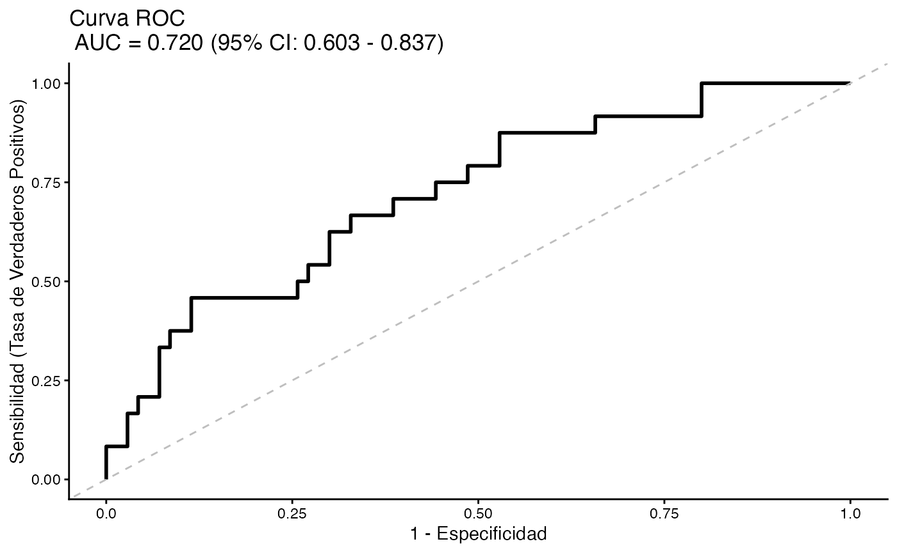

# Introducción a BioEstatR

``` r
library(BioEstatR)
#> --------------------------------------------------------------
#> BioEstatR (ver 1.0.2 - 08/2026)
#>   Biostatistics Routines in R
#>    Pedro Femia*, Miguel Angel Luque Fernandez
#>   Biostatistics Faculty of Medicine - University of Granada
#> 
#>   * Contacto: pfemia@ugr.es, mluquefe@ugr.es
#> --------------------------------------------------------------
data(osteo)
```

## Introducción

Este paquete proporciona una colección de rutinas estadísticas
automatizadas para el análisis descriptivo, y la estadística inferencial
clásica, desarrolladas como soporte para el libro [Matemática
Estadística Médica con
R](https://github.com/migariane/MatematicaEstadisticaMedicinaR).

Todas las funciones han sido actualizadas con referencias científicas a
la literatura estadística fundamental para apoyar su uso y metodología.

En la versión 1.0.2 se han corregido varios procedimientos inferenciales
(el valor p del chi-cuadrado sin corrección por continuidad en
`tabla2x2`, los intervalos exactos de Clopper-Pearson y Garwood-Poisson
en sus casos frontera) y se ha mejorado la robustez de `rls`, `rlm` y
`nl`. Véase `NEWS.md` para el detalle completo.

## Uso

A continuación se muestran ejemplos básicos de uso de las funciones
principales para la modelización lineal y logística.

### Regresión Lineal Simple

``` r
# Ejemplo de regresión lineal simple
rls(imc ~ peso, data = osteo, grf=F)
#> 
#> Regresión lineal simple 
#> ----------------------------------------------------------------
#> # Información muestral --- 
#> 
#>   variable  n  media     dt   Min    Max  Rango
#> 1      imc 94 23.921  3.748 18.07 37.333 19.264
#> 2     peso 94 63.839 11.804 44.60 99.000 54.400
#> 
#>   Cov(imc,peso) = 35.482
#> 
#> # Correlación de Pearson --- 
#> 
#>       r IC_inf IC_sup gl   texp     sig
#>   0.802  0.716  0.864 92 12.876 < 0.001
#> 
#> # Modelo lineal --- 
#> 
#>   Modelo:  imc ~ peso 
#>   R² =  0.643 
#>   S²residual =  5.068 
#>   :
#> 
#>          Coef estim    se ic_inf ic_sup   texp    sig
#> 1 (Constante) 7.664 1.284  5.115 10.214  5.971 <0.001
#> 2        peso 0.255 0.020  0.215  0.294 12.876 <0.001
#> 
#> # Distribución residual --- 
#>   Error estándar residual: 2.251 
#>        res   zres
#> min -5.763 -2.620
#> Q1  -1.533 -0.685
#> Q2  -0.512 -0.230
#> Q3   1.426  0.649
#> max  8.279  3.757
#> 
#>   Test de normalidad residual (Shapiro-Wilk): 
#>   w =0.96, p= 0.005
```

### Regresión Lineal Múltiple

``` r
# Ejemplo de regresión lineal múltiple
new_data <- data.frame(peso = c(70, 80), talla = c(170, 180))
rlm(imc ~ peso + talla, data = osteo, pred = new_data, grf=F)
#> 
#> Regresión lineal múltiple 
#> ----------------------------------------------------------------
#> # Información muestral --- 
#> 
#>   Variable  n   Media     DT    Min     Max
#> 1      imc 94  23.921  3.748  18.07  37.333
#> 2     peso 94  63.839 11.804  44.60  99.000
#> 3    talla 94 163.181  8.795 144.00 190.000
#> 
#> # Modelo lineal --- 
#> 
#>    Modelo :  imc ~ peso + talla 
#>   R² =  0.988  (R²  ajustado  =  0.988 )
#>   S²residual =  0.17 
#> 
#>    Coeficientes del modelo :
#> 
#>       Termino Estimacion Error_Std IC_inf IC_sup   t_exp      sig
#> 1 (Intercept)     48.884     0.835 47.225 50.543  58.522  < 0.001
#> 2        peso      0.380     0.004  0.371  0.389  86.971  < 0.001
#> 3       talla     -0.302     0.006 -0.313 -0.290 -51.431  < 0.001
#> 
#> # Pronósticos con el modelo --- 
#>   Pronosticos puntuales y bandas al 95 % de confianza para 
#>   promedios IC(m), y para una nueva observación: IC(obs)  
#> 
#>   peso talla  Puntual IC_m_inf IC_m_sup IC_obs_inf IC_obs_sup
#> 1   70   170 24.20513 24.09751 24.31276   23.37811   25.03216
#> 2   80   180 24.98938 24.80351 25.17525   24.14859   25.83018
#> 
#> # Distribución residual --- 
#>   Error estándar residual:  0.413 
#>     Residuos Res_Est
#> min   -1.411  -3.587
#> Q1    -0.180  -0.442
#> Q2     0.042   0.102
#> Q3     0.186   0.456
#> max    1.773   4.620
#> 
#>   Test de normalidad residual (Shapiro-Wilk): 
#>    w = 0.926 ,   < 0.001
```

### Regresión Logística Simple

``` r
# Ejemplo de regresión logística simple
rlogits(osteo_cue ~ imc, data = osteo)
#> Waiting for profiling to be done...
#> 
#> Regresión logística  simple
#> ----------------------------------------------------------------
#> # Información muestral --- 
#> 
#>    Tamaño muestral (N inicial) :  94 
#>    Tamaño muestral tras eliminar valores perdidos (Casos completos) :  94 
#>    Mínima frecuencia de eventos (n efectivo) :  24 
#> 
#> # Distribución de la variable respuesta (osteo_cue) ---
#> 
#>   Categoria  n Porcentaje
#> 1        No 70     74.468
#> 2        Sí 24     25.532
#> 
#> # Modelo logístico ---  --- 
#> 
#>    Modelo :  osteo_cue ~ imc 
#>   Devianza residual:  100.176  (Nula:  106.804 )
#>   AIC:  104.176 
#>   R² de Nagelkerke:  0.1 
#> 
#>    Test de bondad de ajuste de Hosmer-Lemeshow :
#>   X² =  7.041 , gl =  8 ,   = 0.532 
#> 
#>    Capacidad discriminante :
#>    AUC (Area bajo la curva ROC)  =  0.649 
#> 
#>    Coeficientes del modelo :
#> 
#>       Termino Estimacion Error_Std  z_exp      sig     OR OR_inf   OR_sup
#> 1 (Intercept)      3.620     2.044  1.771  = 0.077 37.348  0.937 3055.247
#> 2         imc     -0.202     0.089 -2.256  = 0.024  0.817  0.672    0.957
```

### Regresión Logística Múltiple

``` r
# Ejemplo de regresión logística múltiple
rlogitm(osteo_cue ~ imc + edad + tevol, data = osteo, grf=T)
#> Waiting for profiling to be done...
#> 
#> Regresión logística  multiple
#> ----------------------------------------------------------------
#> # Información muestral --- 
#> 
#>    Tamaño muestral (N inicial) :  94 
#>    Tamaño muestral tras eliminar valores perdidos (Casos completos) :  94 
#>    Mínima frecuencia de eventos (n efectivo) :  24 
#> 
#> # Distribución de la variable respuesta (osteo_cue) ---
#> 
#>   Categoria  n Porcentaje
#> 1        No 70     74.468
#> 2        Sí 24     25.532
#> 
#> # Modelo logístico ---  --- 
#> 
#>    Modelo :  osteo_cue ~ imc + edad + tevol 
#>   Devianza residual:  94.571  (Nula:  106.804 )
#>   AIC:  102.571 
#>   R² de Nagelkerke:  0.18 
#> 
#>    Test de bondad de ajuste de Hosmer-Lemeshow :
#>   X² =  10.607 , gl =  8 ,   = 0.225 
#> 
#>    Capacidad discriminante :
#>    AUC (Area bajo la curva ROC)  =  0.72 
#> 
#>    Coeficientes del modelo :
#> 
#>       Termino Estimacion Error_Std  z_exp      sig     OR OR_inf   OR_sup
#> 1 (Intercept)      3.570     2.122  1.683  = 0.092 35.502  0.776 3462.488
#> 2         imc     -0.254     0.099 -2.555  = 0.011  0.776  0.624    0.925
#> 3        edad      0.015     0.035  0.436  = 0.663  1.015  0.948    1.088
#> 4       tevol      0.063     0.034  1.842  = 0.066  1.065  0.997    1.141
#> Scale for x is already present.
#> Adding another scale for x, which will replace the existing scale.
```



## Intervalos de confianza y tablas de contingencia

### IC para una proporción binomial

``` r
# Comparación de métodos: exacto, Wilson, Wald y Agresti-Coull
icp(x = 25, n = 210)
#> 
#> Intervalo de confianza para una proporción binomial 
#> --------------------------------------------------- 
#> 
#> Información muestral: 
#>   Tamaño de muestra: n = 210
#>   Estimación puntual clásica: p=x/n = 0.119, q=(1-p)=0.881
#>   Casos observados: x = 25
#> 
#> # Método exacto (Clooper-Pearson):
#>   Pseudo-estimación puntual: p' = 0.1246, q'=(1-p')=0.8754
#>   95%-IC(π): (0.0785, 0.1707) 
#>   Semiamplitud: 0.0461
#> 
#> # Método de Wilson (con cpc):
#>   Pseudo-estimación puntual: p' = 0.1263, q'=(1-p')=0.8737
#>   95%-IC(π): (0.08, 0.1725) 
#>   Semiamplitud: 0.0463
#> 
#> # Método de Wald (con cpc):
#>   Estimación puntual (clásica): p=x/n = 0.119, q=(1-p)=0.881
#>   95%-IC(π): (0.0729, 0.1652) 
#>   Precisión: 0.0462
#> 
#> # Método de Wald ajustado (Agresti-Coull):
#>   Estimación puntual: p=(x+2)/(n+4) = 0.1262, q=(1-p)=0.8738
#>   95%-IC(π): (0.0817, 0.1707) 
#>   Precisión: 0.0445
```

### IC para el parámetro de una Poisson

``` r
# Método exacto (Garwood) y aproximación normal
icl(x = 25, n = 210)
#> 
#> Intervalo de confianza bilateral para el parámetro  λ de una VA con distribución de Poisson 
#> ----------------------------------------------------------------------------------------------
#> Información muestral: 
#>   Se indica una única observación muestral 210  
#>   Tamaño muestral: n =  210 
#>   Media observada: m =  25 
#> 
#> Estimación: 
#>   [1] Método exacto: 
#>       95 %-IC(λ):  ( 24.3283 ,  25.6856 )
#>       Semiamplitud del intervalo: 0.6787 
#> 
#>   [2] Aproximación a la normal (transformación de la raiz): 
#>       Validez de la aproximación: Σx =  5250  ⩾ 15 (válida) 
#>       95 %-IC(λ):  ( 24.3283 ,  25.6857 )
#>       Precisión obtenida: 0.6787
```

### Tablas de contingencia 2x2

``` r
# Análisis completo de una tabla 2x2 en estudio transversal
tabla2x2(o = c(20, 26, 60, 294), estudio = "T", tablas = c("F", "S"))
#> 
#> # Análisis de tablas 2x2
#> # ----------------------
#> 
#> # Frecuencias observadas
#>           C1   C2 Total
#>   F1      20   26    46
#>   F2      60  294   354
#>   Total   80  320   400
#> 
#> 
#> # Test Chi-cuadrado para un estudio transversal
#> 
#>   χ² = 17.903,   gl = 1,  p < 0.001, (cpc = 0.5) 
#>   Validez: Frecuencia mínima esperada = 9.20  > 3.9  
#> 
#>   Test exacto de Fisher (bilateral): p < 0.001 
#> 
#>   --- Otros criterios χ²:  
#>   χ² = 17.907,   gl = 1,  p < 0.001, (sin cpc) 
#>   χ² = 16.287,   gl = 1,  p < 0.001, (cpc de Yates = 200.00) 
#> 
#> # Residuos estandarizados
#>          C1     C2
#>   F1  4.232 -4.232
#>   F2 -4.232  4.232
#> 
#> # Porcentajes por filas
#>            C1    C2 Total
#>   F1    0.435 0.565 1.000
#>   F2    0.169 0.831 1.000
#>   Total 0.200 0.800 1.000
#> 
#> # Estimación de la prevalenciaπ en un estudio transversal
#>   Método de Wald ajustado: 
#>   p=0.119; 95%-IC(π)=(0.087, 0.150) 
#> 
#> # Medidas de asociación para un estudio transversal
#>   [!] Las medidas de riesgo se calculan como riesgo de la categoría  
#>       en la 1a columna (frente a la 2a) para la categoría en la 1a 
#>       fila (frente a la 2a)
#> 
#>   Riesgo absoluto (diferencia de Berkson; método de Agresti-Caffo): 
#>   d=0.169; 95%-IC(d)=(0.073, 0.271) 
#> 
#>   Riesgo relativo: 
#>   Rr=3.077; 95%-IC(Rr)=(1.818, 5.169) 
#> 
#>   Riesgo atribuible:
#>   Ra=0.293; 95%-IC(Ra)= (0.104, 0.443) 
#> 
#>   Razón del producto cruzado (odds ratio):
#>   OR=3.769; 95%-IC(OR)= (1.987, 7.137)
```

Para más información, consulte la documentación individual de cada
función mediante `?funcion`.
